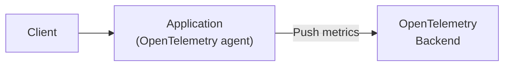

## 概要

[OpenTelemetry](https://opentelemetry.io/)はPush方式でアプリケーションのメトリクスを公開します。

## 機能

### 1. メトリクスエクスポート機能

メトリクスエクスポート機能はアプリケーションのメトリクスをオブザーバビリティバックエンドへ公開します。

[OpenTelemetry](https://opentelemetry.io/)を利用する場合は、エージェントがアプリケーションからOpenTelemtryバックエンドに向けてメトリクスを送信します。



以下は、Opentelemetryよりメトリクスを公開する例です。

```go
{}
```

### 2. APIリクエスト統計取得機能

APIリクエスト統計取得機能はAPIコールに関するメトリクスを取得する機能です。
この機能はサーバサイドミドルウェア、あるいはクライアントサイドミドルウェアとして機能します。

APIコールは以下の項目によりグルーピングされ、カウントされます。

- method: HTTPメソッド
- host: ホスト名
- path: URLパス
- code: ステータスコード

サーバサイドのAPIメトリクスを取得するにはサーバサイドミドルウェアを利用します。
クライアントサイドのAPIメトリクスを取得するにはクライアントサイドミドルウェアを利用します。

## セキュリティに関する特記事項

メトリクスのエンドポイントに適切なアクセス制御を行ってください。

## 性能に関する特記事項

性能に関する特記事項は特にありません。

## 実装例・使い方

### メトリクス公開

OpenTelemtryはPush方式でメトリクスを公開します。
以下の実装例の通り、OpenTelemtryのエージェントを作成することでメトリクスをバックエンドへ送信できます。

```go
{}
```

以下にサンプルのdocker-composeとOpenTelemetryコレクターのconfigファイル、Prometheusのconfigファイルを示します。

```yaml
{ { % code source="ex_basic_grpc/docker-compose.yaml" % } }
```

```yaml
{ { % code source="ex_basic_grpc/prometheus.yaml" % } }
```

なお、HTTPによりバックエンドへメトリクスを送信する場合は以下のように利用します。

```go
{}
```

また、デバッグなどで標準出力にメトリクスを出力する場合は以下の通りです。

```go
{}
```

### サーバサイドAPIメトリクス

サーバサイドでAPIコールのメトリクスを取得するにはサーバサイドミドルウェアを利用します。
以下に簡単な利用例を示します。

```go
{}
```

### クライアントサイドAPIメトリクス

クライアントサイドでAPIコールのメトリクスを取得するにはクライアントサイドミドルウェアを利用します。
以下に簡単な利用例を示します。

```go
{}
```
