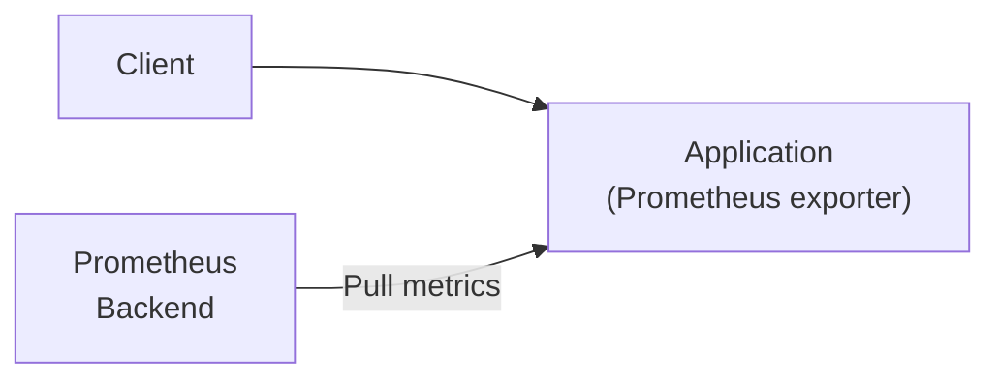

## 概要

[Prometheus](https://prometheus.io/)はPull方式でアプリケーションのメトリクスを公開します。

## 機能

### 1. メトリクスエクスポート機能

メトリクスエクスポート機能はアプリケーションのメトリクスをオブザーバビリティバックエンドへ公開します。

[Prometheus](https://prometheus.io/)は、Pull方式でメトリクスを公開します。この時、PrometheusエクスポータがハンドラとしてHTTPサーバに登録され、エンドポイントを通じてアクセスできる必要があります。
Prometheusバックエンドはエンドポイントにアクセスし、メトリクスを収集します。



以下の実装例は、簡単なアクセスログとともにPrometheusによりメトリクスを公開する例です。

```go
{}
```

### 2. APIリクエスト統計取得機能

APIリクエスト統計取得機能はAPIコールに関するメトリクスを取得する機能です。
この機能はサーバサイドミドルウェア、あるいはクライアントサイドミドルウェアとして機能します。

APIコールは以下の項目によりグルーピングされ、カウントされます。

- method: HTTPメソッド
- host: ホスト名
- path: URLパス
- code: ステータスコード

サーバサイドのAPIメトリクスを取得するにはサーバサイドミドルウェアを利用します。
クライアントサイドのAPIメトリクスを取得するにはクライアントサイドミドルウェアを利用します。

## セキュリティに関する特記事項

メトリクスのエンドポイントに適切なアクセス制御を行ってください。

## 性能に関する特記事項

性能に関する特記事項は特にありません。

## 実装例・使い方

### メトリクス公開

PrometheusはPull方式でメトリクスを公開します。
以下の実装例の通り、Prometheusエクスポータ（ハンドラ）をサーバに登録することで利用できます。

```go
{}
```

公開されているエンドポイントを通して、メトリクスを取得します。

以下にサンプルのdocker-composeとprometheusのconfigファイルを示します。

```yaml
{ { % code source="ex_basic/docker-compose.yaml" % } }
```

```yaml
{ { % code source="ex_basic/prometheus.yaml" % } }
```

### サーバサイドAPIメトリクス

サーバサイドでAPIコールのメトリクスを取得するにはサーバサイドミドルウェアを利用します。
以下に簡単な利用例を示します。

```go
{}
```

### クライアントサイドAPIメトリクス

クライアントサイドでAPIコールのメトリクスを取得するにはクライアントサイドミドルウェアを利用します。
以下に簡単な利用例を示します。

```go
{}
```
